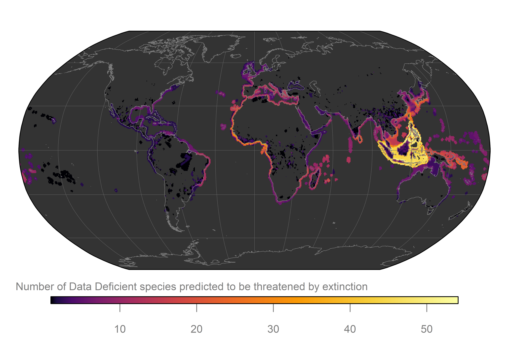

## Extinction Risk of Data Deficient species
Numerous species of the IUCN Red List of Threatened Species are classified as [Data Deficient](https://www.iucnredlist.org/search?permalink=2ed13c01-7e0e-4596-a100-38ed47d30a99). This code was used to predict probabilities of being threatened by extinction for Data Deficient species containing range map data available from the IUCN [spatial data download](https://www.iucnredlist.org/resources/spatial-data-download).

The classifier can be applied for individual species using our [web application](https://ml-extinctionrisk.indecol.no/) (alpha version)

## Predictor data

#### The following datasets need to be downloaded individually from third-party data sources:

-   Water scarcity footprints ([Boulay et al. 2018](https://doi.org/10.1007/s11367-017-1333-8))
-   Freshwater connectivity indices ([Barbarossa et al. 2020](https://doi.org/10.1073/pnas.1912776117))
-   Global Database of Power Plants ([Byers et al. 2019](https://datasets.wri.org/dataset/globalpowerplantdatabase))
-   Global dataset of more than 38,000 georeferenced dams ([Mulligan et al. 2020](https://doi.org/10.1038/s41597-020-0362-5))
-   [Human development index](http://hdr.undp.org/sites/default/files/2020_statistical_annex_all.xlsx)
-   [Corruption Perceptions Index 2020](https://images.transparencycdn.org/images/CPI_FULL_DATA_2021-01-27-162209.zip)
-   Global threats from invasive alien species ([Early et al. 2016](https://doi.org/10.1038/ncomms12485))
-   ESA CCI [Land cover](http://maps.elie.ucl.ac.be/CCI/viewer/download.php)
-   Marine data layers for ecological modelling: [Bio-ORACLE](https://bio-oracle.org)
-   Climatologies at high resolution ([Karger et al. 2018](https://doi.org/10.5061/dryad.kd1d4))
-   Global terrestrial Human Footprint maps for 2009 ([Venter et al. 2016](https://doi.org/10.1038/sdata.2016.67))
-   Human modification gradient ([Kennedy et al. 2019](https://doi.org/10.1111/gcb.14549))
-   Urban expansion probabilities ([Seto et al. 2012](https://doi.org/10.1073/pnas.1211658109))
-   Forest Cover Change ([Hansen et al. 2013](https://doi.org/10.1126/science.1244693))
-   Habitat heterogeneity ([Tuanmu & Jetz 2015](https://doi.org/10.1111/geb.12365))
-   Pesticide application rates ([Maggi et al. 2019](https://doi.org/10.1038/s41597-019-0169-4))
-   Freshwater environmental variables ([Domisch et al. 2015](https://doi.org/10.1038/sdata.2015.73))
-   Human Impacts on Marine Ecosystems ([Halpern et al. 2008](https://doi.org/10.1126/science.1149345))
-   World Database on Protected Areas ([UNEP-WCMC & IUCN 2021](www.protectedplanet.net))

Pre-processing steps, e.g., calculating land-use fractions, etc. are stored in [raster_preparation](https://github.com/jannebor/dd_forecast/tree/main/workflow/1_Preparation/raster_preparation)

## Model preparation

[data_extraction.R](https://github.com/jannebor/dd_forecast/blob/main/workflow/1_Preparation/model_preparation/data_extraction.R) is the underlying function for retrieving predictor data from tables, web sources (i.e., IUCN, GBIF & OBIS), and the above downloaded spatial datasets for single species, and is applied for entire spatial datasets in [data_extraction_batch.R](https://github.com/jannebor/dd_forecast/blob/main/workflow/1_Preparation/model_preparation/2_data_extraction_batch.R)

Training (75%) and testing (25%) data was [prepared](https://github.com/jannebor/dd_forecast/blob/main/workflow/1_Preparation/model_preparation/3_model_prep.R) for each partition (partition 1: all species, partition 2: marine & non-marine species separately) and relevant [features selected](https://github.com/jannebor/dd_forecast/blob/main/workflow/1_Preparation/model_preparation/3.1_feature_selection.R) using the Boruta algorithm [Kursa & Rudnicki 2010](https://doi.org/10.18637/jss.v036.i11).

## Model training

In total 510 models were fitted using [AutoML](https://docs.h2o.ai/h2o/latest-stable/h2o-docs/automl.html) in H2O. 222 models were fitted using all species ([partition 1](https://github.com/jannebor/dd_forecast/blob/main/workflow/2_Training/model_partition1.R)), 134 using only marine species and 154 using only non-marine species ([partition 2](https://github.com/jannebor/dd_forecast/blob/main/workflow/2_Training/model_partition2.R)).

All models were calibrated using 10-fold cross-validation, and ranked in terms of AUC based on the set aside testing data (25%), e.g. for partition 1:

| model_id                                 | auc   | logloss | aucpr | mean_per_class_error | rmse  | mse   |
|------------------------------------------|-------|---------|-------|----------------------|-------|-------|
| StackedEnsemble_AllModels_3\_AutoML_1    | 0.912 | 0.314   | 0.795 | 0.174                | 0.311 | 0.097 |
| StackedEnsemble_AllModels_6\_AutoML_1    | 0.912 | 0.315   | 0.795 | 0.175                | 0.311 | 0.097 |
| StackedEnsemble_AllModels_4\_AutoML_1    | 0.912 | 0.315   | 0.795 | 0.175                | 0.311 | 0.097 |
| StackedEnsemble_AllModels_5\_AutoML_1    | 0.910 | 0.318   | 0.791 | 0.176                | 0.313 | 0.098 |
| StackedEnsemble_BestOfFamily_4\_AutoML_1 | 0.909 | 0.318   | 0.793 | 0.184                | 0.313 | 0.098 |

## Model evaluation

Performance metrics were calculated based on the testing data and reclassified Data Deficient species

Permutation variable importance was assessed

## Predictions

The generated predictions are stored in [dd_predictions.csv](https://github.com/jannebor/dd_forecast/blob/main/dd_predictions.csv) and show the probability of being threatened by extinction for each species:

| Species                         | Taxonomic class | RL category    | Probability of threat |
|---------------------------------|-----------------|----------------|-----------------------|
| Nyctibatrachus sholai           | Amphibia        | Data Deficient | 95.4%                 |
| Eleutherodactylus verruculatus  | Amphibia        | Data Deficient | 95.3%                 |
| Micrixalus thampii              | Amphibia        | Data Deficient | 95.0%                 |
| Crossodactylus dantei           | Amphibia        | Data Deficient | 94.7%                 |
| Physalaemus barrioi             | Amphibia        | Data Deficient | 94.7%                 |
| Crotaphatrema tchabalmbaboensis | Amphibia        | Data Deficient | 94.5%                 |
| Cryptotis lacertosus            | Mammalia        | Data Deficient | 94.4%                 |
| Physalaemus erythros            | Amphibia        | Data Deficient | 94.4%                 |
| Gastrotheca williamsoni         | Amphibia        | Data Deficient | 94.4%                 |
| …                               |                 |                |                       |
